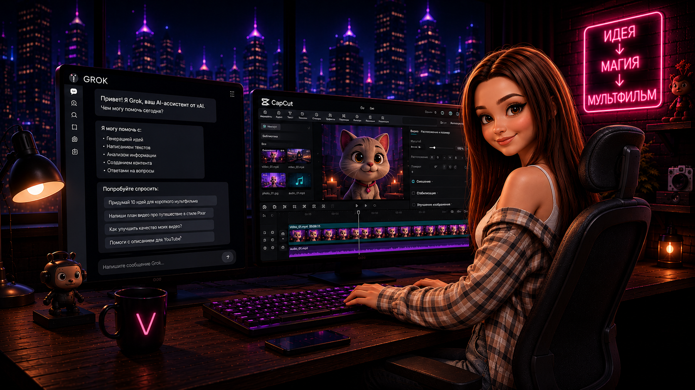

# ✨ your.story — AI Creator Studio

Современный сайт AI-студии **your.story**, которая создаёт рекламные ролики,
персонажей, AI-мультфильмы и визуальные истории с использованием генеративных технологий.

🌐 **Сайт:** https://ar4i23.github.io/ai_creator/

---

## ✨ Что умеет проект

- 🎬 **AI-видеопроизводство** — создание рекламных роликов и визуальных историй
- 🧑‍🎨 **AI-персонажи** — разработка персонажей и визуального образа бренда
- 🎞️ **AI-мультфильмы** — создание коротких мультфильмов и сюжетных роликов
- 📖 **Сценарии и идеи** — разработка концепции, сценария и визуальной подачи
- 📺 **AI-сериалы** — создание серийного контента из AI-роликов
- 💻 **Адаптивный интерфейс** — полноценная работа на desktop, tablet и mobile
- 🌙 **Две темы** — поддержка светлой и тёмной темы
- 📩 **Заявки в Telegram** — отправка данных формы через API

---

## 🖼️ Превью сайта

---

## 📁 Структура проекта

    ai_creator/
    ├── index.html                    # Главная страница
    ├── privacy.html                  # Политика конфиденциальности
    ├── README.md                     # Документация проекта
    │
    ├── api/
    │   └── send-lead.js              # API для отправки заявок
    │
    ├── css/
    │   └── modules/                  # Модульная структура стилей
    │       ├── base.css              # Базовые стили и переменные
    │       ├── content.css           # Основные секции контента
    │       ├── faq.css               # FAQ и интерактивный аккордеон
    │       ├── footer.css            # Footer
    │       ├── form.css              # Формы и валидация
    │       ├── header.css             # Header и навигация
    │       ├── hero.css              # Hero-секция
    │       ├── hero-variants.css     # Варианты Hero
    │       ├── media.css              # Адаптивность
    │       ├── neon.css               # Неоновые эффекты
    │       ├── packages.css           # Пакеты и цены
    │       └── results.css            # Результаты / кейсы
    │
    ├── js/
    │   ├── main.js                   # Точка входа JavaScript
    │   │
    │   └── modules/
    │       ├── carousel.js            # 3D-карусель форматов
    │       ├── faq.js                 # FAQ: поиск, аккордеон, управление
    │       ├── form-validation.js     # Валидация форм
    │       ├── menu.js                # Мобильное меню
    │       ├── packages-accordion.js  # Аккордеон пакетов
    │       ├── reveal.js              # Анимации появления
    │       ├── steps-scroll-reveal.js # Timeline с анимацией при скролле
    │       ├── telegram.js             # Отправка заявок в Telegram
    │       ├── theme.js                # Переключение темы
    │       └── works-gallery.js        # Галерея работ и fullscreen modal
    │
    ├── img/
    │   ├── hero.png                   # Основное изображение Hero
    │   ├── hero_light.png             # Светлая версия Hero
    │   │
    │   ├── benefits/                  # Изображения преимуществ
    │   ├── formats/                   # Форматы AI-контента
    │   ├── logo/                      # Логотип и favicon
    │   ├── packages/                  # Изображения пакетов
    │   └── works/                     # Работы / кейсы
    │
    └── ...

---

## 🎨 Основные секции

### 🦸 Hero

Полноэкранный первый экран с визуальным оформлением в стиле AI Creator,
основным CTA и поддержкой светлой и тёмной темы.

Hero адаптируется под различные размеры экранов и использует отдельные
визуальные варианты для разных тем.

### 💡 Почему сюжет

Интерактивная секция, которая показывает преимущества использования
сторителлинга и AI-контента.

Элементы секции появляются с анимацией при прокрутке страницы.

### 🎞️ Форматы

Интерактивная 3D-карусель форматов AI-контента.

Включает:

- AI-мультфильмы
- персонажей бренда
- рекламные AI-ролики
- сценарии и идеи
- AI-сериалы

Карусель поддерживает автоматическую прокрутку и визуальные эффекты.

### 🎬 Работы

Галерея реализована в формате асимметричной **Bento Grid**.

Основной кейс занимает увеличенную область, остальные работы формируют
дополнительные карточки вокруг него.

При нажатии на работу открывается fullscreen-просмотр.

### 💎 Пакеты и цены

Интерактивные карточки пакетов с accordion-механикой.

Каждый пакет содержит информацию о:

- составе работ;
- возможностях;
- стоимости;
- дополнительных условиях.

Карточки поддерживают hover-эффекты и открытие информации по клику.

### 🧭 Как проходит работа

Вместо стандартной сетки используется вертикальный timeline:

    01 ─ Заявка
           │
    02 ─ Бриф
           │
    03 ─ Идея и сценарий
           │
    04 ─ Производство
           │
    05 ─ Правки
           │
    06 ─ Сдача проекта

Каждый этап появляется при прокрутке страницы.

На desktop карточки располагаются по разные стороны центральной
неоновой линии, а на мобильных устройствах timeline превращается
в вертикальную последовательность.

### ❓ FAQ

Интерактивный раздел вопросов и ответов.

Реализовано:

- accordion;
- поиск по вопросам;
- отображение количества найденных вопросов;
- открытие всех вопросов;
- закрытие всех вопросов;
- индикатор прогресса;
- автоматическое скрытие нерелевантных результатов;
- адаптивная мобильная версия.

---

## ⚙️ Технологии

### Frontend

- HTML5
- CSS3
- JavaScript ES Modules
- Flexbox
- CSS Grid
- CSS Custom Properties
- Responsive Web Design
- BEM

### Интерактив

- Intersection Observer API
- CSS 3D Transforms
- Accordion
- Fullscreen Modal
- Live Form Validation
- Theme Switching
- Scroll Reveal Animations

### API

- JavaScript
- Serverless API
- Telegram Bot API

---

## 📱 Адаптивность

Сайт адаптирован под различные устройства:

- 🖥️ Desktop
- 💻 Laptop
- 📲 Tablet
- 📱 Mobile

Адаптивная логика предусмотрена для:

- Header;
- Hero;
- карточек;
- Bento Grid;
- 3D-карусели;
- Timeline;
- FAQ;
- форм;
- пакетов и цен.

---

## 🧩 Архитектура JavaScript

JavaScript организован по модульному принципу.

    js/
    ├── main.js
    └── modules/
        ├── carousel.js
        ├── faq.js
        ├── form-validation.js
        ├── menu.js
        ├── packages-accordion.js
        ├── reveal.js
        ├── steps-scroll-reveal.js
        ├── telegram.js
        ├── theme.js
        └── works-gallery.js

`main.js` является точкой входа и подключает отдельные функциональные
модули проекта.

Такой подход позволяет изолировать функциональность отдельных секций,
упрощает поддержку и дальнейшее расширение проекта.

---

## 📩 Работа с формами

Формы используют клиентскую валидацию перед отправкой данных.

Основной процесс:

    Пользователь
         ↓
    Заполняет форму
         ↓
    Client-side validation
         ↓
    API endpoint
         ↓
    Telegram Bot API
         ↓
    Заявка поступает в Telegram

Валидация выполняется в реальном времени и предотвращает отправку
некорректных данных.

---

## 🚀 Локальный запуск

Проект не использует обязательный frontend-сборщик и может запускаться
через локальный HTTP-сервер.

Например:

    python3 -m http.server 8000

После запуска открыть:

    http://localhost:8000

Для разработки также можно использовать **Live Server** в VS Code.

---

## 🌐 Деплой

Проект размещён через **GitHub Pages**.

Production:

**https://ar4i23.github.io/ai_creator/**

После внесения изменений:

    git add .
    git commit -m "Описание изменений"
    git push

После обновления GitHub Pages новая версия проекта публикуется
автоматически.

---

## 🔄 Рабочий процесс

Типичный workflow проекта:

    Изменение кода
          ↓
    Локальное тестирование
          ↓
    Проверка адаптивности
          ↓
    Git commit
          ↓
    Git push
          ↓
    GitHub Pages
          ↓
    Production

---

## 🛡️ Безопасность

- API-логика отделена от frontend-кода
- чувствительные данные не должны храниться в HTML
- Telegram credentials не должны попадать в публичный репозиторий
- формы проходят клиентскую валидацию
- пользовательские данные обрабатываются через API

---

## 🧪 Тестирование

Перед публикацией рекомендуется проверить:

- работу навигации;
- мобильное меню;
- переключение темы;
- работу 3D-карусели;
- открытие работ в fullscreen;
- accordion пакетов;
- timeline при прокрутке;
- поиск и accordion FAQ;
- валидацию форм;
- отправку заявки;
- адаптивность на мобильных устройствах.

---

## 📌 Статус проекта

**Active Development**

Проект находится в активной разработке и может расширяться новыми
AI-инструментами, визуальными решениями и интерактивными компонентами.

---

## 👨‍💻 Автор

**Arthur / Ar4i23**

Frontend / Web Developer

**Основной стек:**

`HTML` · `CSS` · `JavaScript` · `BEM` · `Responsive Design` · `API` · `Git`

---

⭐ Если проект был полезен или понравился — поставьте звезду репозиторию.
